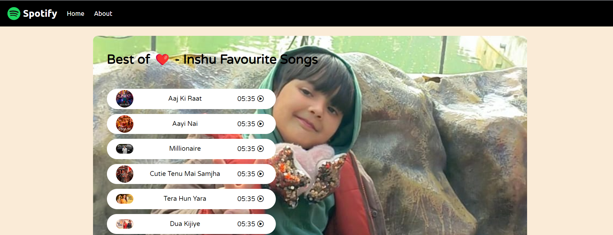
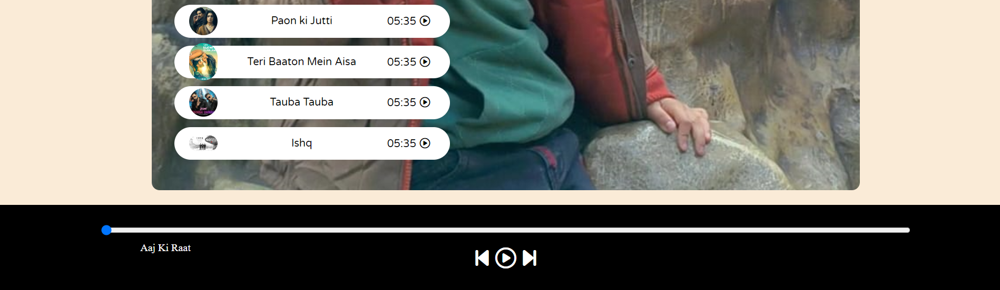

**Spotify - Your Favorite Music is Here**

Welcome to Spotify, a simple web application where you can enjoy your favorite music hassle-free. This project is a basic implementation of a music player with a song playlist and playback controls.

**Features:**
- Play, pause, and skip functionality for songs.
- Progress bar to visualize the playback progress of the current song.
- Dynamic song list with song names and cover images.
- Responsive design for seamless user experience across devices.

**Technologies Used:**
- HTML
- CSS
- JavaScript

**How to Use:**
1. Open the `index.html` file in your web browser.
2. Browse through the list of songs.
3. Click on the play icon next to a song to start playback.
4. Use the playback controls at the bottom of the page to manage playback (play, pause, skip).
5. Enjoy your favorite music!

**Credits:**
- Songs used in this project are sourced from various artists and are for demonstration purposes only.
- Images used for the song covers are for demonstration purposes only.

**Disclaimer:**
This project is created for educational purposes and is not intended for commercial use. All music and images used are placeholders and should not be redistributed or used for commercial purposes.

**Author:**
NADEEM AHAMAD

**Contact:**
nadeem.blp.2050@gmail.com

**License:**
This project is licensed under the [licence](LICENSE).

**Contributing:**
Contributions are welcome! If you'd like to contribute to this project, feel free to fork the repository and submit a pull request with your changes.

**Issues:**
If you encounter any issues or have suggestions for improvement, please open an issue on the GitHub repository.

**Acknowledgments:**
Special thanks to [any acknowledgments you want to include].

**Enjoy your music!**

**Screenshot**
 
 

**To Use and Update this Project**

Clone the repository:
   ```bash
   https://https://github.com/nadeemahamad007/Spotify-Your-Favorite-Music-is-Here
